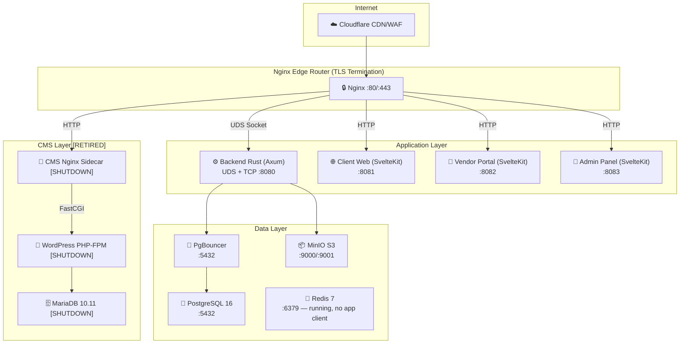
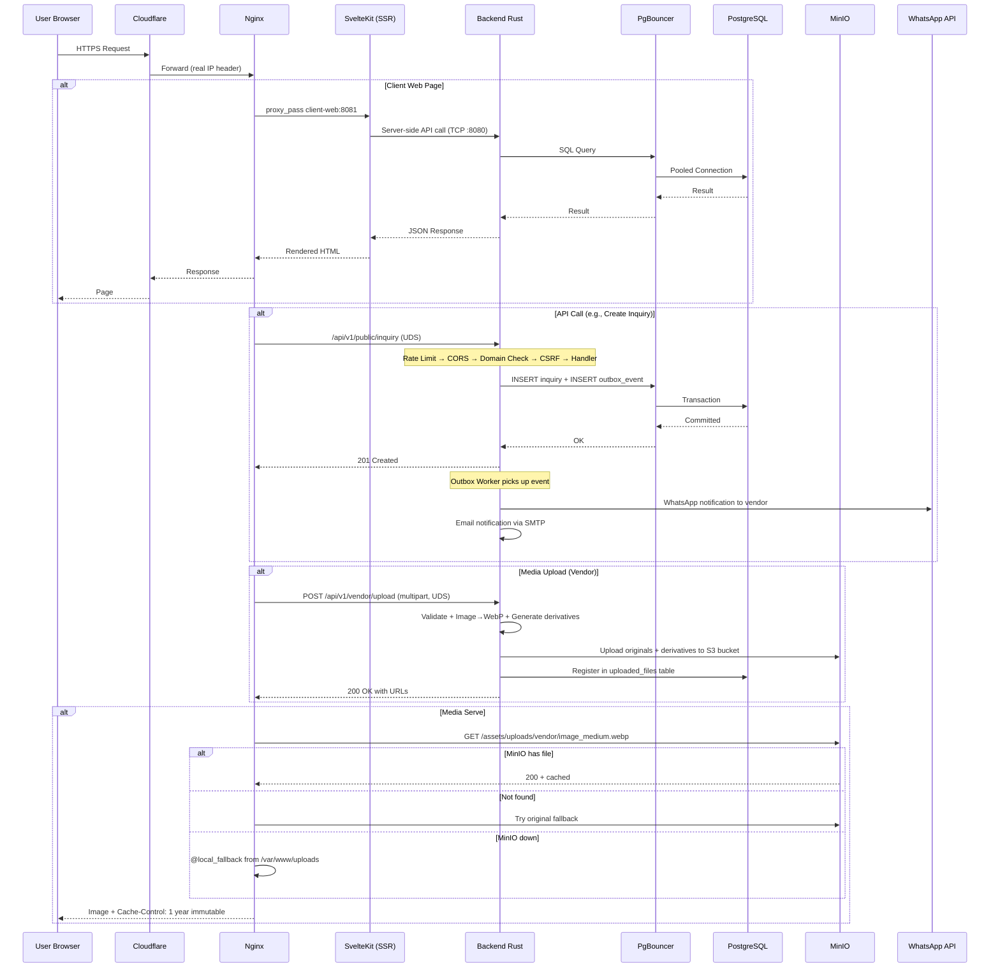

# 🏗️ ZafafWorld — Complete Project Summary (End-to-End)

> **ZafafWorld** ek **wedding vendor marketplace platform** hai jo Saudi Arabia/Gulf region ke liye designed hai. Clients (couples) yahan vendors (photographers, venues, decorators etc.) dhundhte hain, inquiries bhejte hain, bookings karte hain, aur reviews dete hain.

---

## 📊 Architecture Overview



---

## 🌐 Domain Mapping

| Domain | Service | Port | Purpose |
|--------|---------|------|---------|
| `zafafworld.net` | client-web | 8081 | Public-facing client website |
| `api.zafafworld.net` | backend-rust | UDS/8080 | REST API + WebSocket |
| `vendor.zafafworld.net` | vendor-portal | 8082 | Vendor dashboard/management |
| `admin.zafafworld.net` | admin-panel | 8083 | Admin control panel |
| `blog.zafafworld.net` | [RETIRED] WordPress CMS | [RETIRED] | Decommissioned as of July 2026 |

---

## 1️⃣ Backend Rust (`/backend-rust`)

### Technology Stack
- **Language**: Rust (Edition 2021)
- **Framework**: Axum 0.7 + Tokio async runtime
- **Database**: SQLx 0.8 (compile-time checked queries) + PostgreSQL
- **ORM Pattern**: Repository Pattern (raw SQL, no ORM)
- **Transport**: Dual-mode — **Unix Domain Socket** (production, zero-TCP latency) + **TCP** (dev/internal SSR)

### Source Structure (`src/`)

#### 📄 [main.rs](backend-rust/src/main.rs) — Entry Point (995 lines)
- **CLI Subcommands**: `run-migrations`, `transcode-existing-videos`, `verify-media-pipeline`, `bootstrap-admin`, `reset-admin-password`
- **Pre-flight checks**: ffmpeg/ffprobe verification, PostgreSQL RLS role verification
- **Background workers**: Chat event stream, Booking event stream, Inquiry webhook, Outbox worker, Idempotency pruner
- **Transport**: UDS on `/var/run/zafaf/zafaf.sock` (production) + TCP on `:8080`
- **Health probes**: `/health` (full), `/readiness` (DB-only), `/liveness` (process-only)
- **Graceful shutdown**: SIGTERM/Ctrl-C with 30s drain window

#### 📄 [config.rs](backend-rust/src/config.rs) — Configuration (499 lines)
- Loads all env vars: Database, JWT, SMTP, WhatsApp, MinIO, Outbox settings
- **Security**: Shannon entropy validation on JWT_SECRET, known insecure secret blocklist
- **SMTP**: Hostinger mail (port 465, implicit TLS)
- **MinIO**: S3-compatible object storage config

#### 📄 [state.rs](backend-rust/src/state.rs) — Application State
- `AppState`: Shared across all handlers — DB pool, JWT secret, services, broadcast channels
- `WsManager`: DashMap-based WebSocket connection manager (multi-connection per user, O(1) deregister)
- `BookingEvent`, `ChatEvent`, `InquiryEvent`: Typed broadcast events

---

### API Routes (`src/routes/`)

#### 🔓 Public Routes (`/api/v1/public`)
| Module | File | Description |
|--------|------|-------------|
| [public.rs](backend-rust/src/routes/public.rs) | 96KB | Vendor listing search, category browsing, vendor detail, public reviews, gallery |
| [cms_discover](backend-rust/src/routes/cms_discover) | public_blogs, public_articles | Blog posts & articles (native & historical WP) |
| [reference_metadata](backend-rust/src/routes/reference_metadata) | public.rs | Cities, countries, features metadata |
| [inquiry_management](backend-rust/src/routes/inquiry_management) | public.rs | Public inquiry submission |
| [booking_workflow](backend-rust/src/routes/booking_workflow) | public.rs | Public booking flow |
| [vendor_management](backend-rust/src/routes/vendor_management) | registration.rs | Vendor self-registration |

#### 🔐 Identity Routes (`/api/v1/auth`)
| File | Description |
|------|-------------|
| [auth.rs](backend-rust/src/routes/identity/auth.rs) (30KB) | Login, register, forgot-password, reset-password, token refresh, JWT cookie management |

#### 👤 Client Routes (`/api/v1/client`)
| Module | Description |
|--------|-------------|
| [client.rs](backend-rust/src/routes/client.rs) (27KB) | Client profile, dashboard, reviews, favorites |
| [client_wedding_planner](backend-rust/src/routes/client_wedding_planner) | Favorites, Budget tracker, Checklist, Documents, Timeline |
| [financial_ops/client.rs](backend-rust/src/routes/financial_ops/client.rs) | Client payment history |
| [content_moderation/client.rs](backend-rust/src/routes/content_moderation/client.rs) | Client-side review moderation |
| [inquiry_management/client.rs](backend-rust/src/routes/inquiry_management/client.rs) | Client inquiry management |
| [booking_workflow/client.rs](backend-rust/src/routes/booking_workflow/client.rs) (16KB) | Client booking management |

#### 🏪 Vendor Routes (`/api/v1/vendor`)
| Module | Description |
|--------|-------------|
| [vendor.rs](backend-rust/src/routes/vendor.rs) (48KB) | Vendor dashboard, gallery, stats, media uploads |
| [vendor_management/products.rs](backend-rust/src/routes/vendor_management/products.rs) (75KB) | Full product CRUD — images, videos, pricing, features, descriptions |
| [vendor_management/profile.rs](backend-rust/src/routes/vendor_management/profile.rs) | Vendor profile management |
| [vendor_management/packages.rs](backend-rust/src/routes/vendor_management/packages.rs) | Vendor service packages |
| [vendor_management/staff.rs](backend-rust/src/routes/vendor_management/staff.rs) | Vendor staff management |
| [financial_ops/vendor.rs](backend-rust/src/routes/financial_ops/vendor.rs) | Vendor financial operations |
| [inquiry_management/vendor.rs](backend-rust/src/routes/inquiry_management/vendor.rs) | Vendor inquiry responses |
| [booking_workflow/vendor.rs](backend-rust/src/routes/booking_workflow/vendor.rs) (16KB) | Vendor booking actions (accept/reject/complete) |

#### 👑 Admin Routes (`/api/v1/admin`)
| Module | Description |
|--------|-------------|
| [admin.rs](backend-rust/src/routes/admin.rs) (56KB) | Users, vendors, listings, subscriptions, settings, system management |
| [vendor_management/admin.rs](backend-rust/src/routes/vendor_management/admin.rs) (52KB) | Full vendor lifecycle management — approve, reject, suspend |
| [inquiry_management/admin.rs](backend-rust/src/routes/inquiry_management/admin.rs) (41KB) | Inquiry escalation, assignment, analytics |
| [cms_discover/admin_articles.rs](backend-rust/src/routes/cms_discover/admin_articles.rs) | Native article CRUD editor |
| [cms_discover/blog_moderation.rs](backend-rust/src/routes/cms_discover/blog_moderation.rs) | Blog post moderation queue |
| [financial_ops/admin.rs](backend-rust/src/routes/financial_ops/admin.rs) | Commission management, payouts |
| [content_moderation/admin.rs](backend-rust/src/routes/content_moderation/admin.rs) | Review moderation queue |
| [identity/admin.rs](backend-rust/src/routes/identity/admin.rs) (15KB) | User management, role assignment |
| [booking_workflow/admin.rs](backend-rust/src/routes/booking_workflow/admin.rs) | Admin booking oversight |

#### 💬 Real-time Routes
| Module | Description |
|--------|-------------|
| [conversations/mod.rs](backend-rust/src/routes/conversations/mod.rs) (39KB) | WebSocket chat system — messages, read receipts, conversations, attachments |
| [listing_promotions](backend-rust/src/routes/listing_promotions) (82KB) | Vendor listing promotion/featured placement system |

#### 🔧 Internal/Utility Routes
| Module | Description |
|--------|-------------|
| [telemetry_diagnostics](backend-rust/src/routes/telemetry_diagnostics) | Events tracking, feature flags, metrics endpoints |

---

### Middleware Stack (`src/middleware/`)

| # | Middleware | File | Purpose |
|---|-----------|------|---------|
| 1 | Request Logger | [logging.rs](backend-rust/src/middleware/logging.rs) | Request/response logging with timing |
| 2 | Rate Limiter | [rate_limit.rs](backend-rust/src/middleware/rate_limit.rs) | Token-bucket rate limiting, JWT decode + cache |
| 3 | Timeout | tower-http | 120s hard request timeout |
| 4 | Panic Catcher | tower-http | Converts panics to 500 JSON responses |
| 5 | CORS | tower-http | Predicate-based origin matching |
| 6 | Domain Segregation | [auth.rs](backend-rust/src/middleware/auth.rs) (17KB) | Client/Vendor/Admin domain isolation |
| 7 | CSRF Protection | [csrf.rs](backend-rust/src/middleware/csrf.rs) | X-CSRF-Token validation for mutations |
| 8 | Security Headers | [security.rs](backend-rust/src/middleware/security.rs) | HSTS, X-Frame-Options, etc. |

Additional middleware:
- [idempotency.rs](backend-rust/src/middleware/idempotency.rs) — Idempotency-Key support for safe retries

---

### Services (`src/services/`)

| Service | Description |
|---------|-------------|
| [email.rs](backend-rust/src/services/email.rs) (24KB) | Lettre-based SMTP email (Hostinger, implicit TLS) — password reset, booking confirmation, inquiry notifications |
| [whatsapp.rs](backend-rust/src/services/whatsapp.rs) (7.6KB) | WhatsApp Business API (Meta Graph API) — notification templates for inquiry alerts |
| [outbox_worker.rs](backend-rust/src/services/outbox_worker.rs) (20KB) | Transactional Outbox Pattern — guaranteed delivery for email/WhatsApp with retry schedule |
| [category_schema.rs](backend-rust/src/services/category_schema.rs) (22KB) | Dynamic category-specific feature schema engine |
| [metrics.rs](backend-rust/src/services/metrics.rs) | Application metrics collection (Prometheus text format; no nginx IP restriction currently) |
| [wp_cache_sync.rs](backend-rust/src/services/wp_cache_sync.rs) (16KB) | Background worker: polls `blog.zafafworld.net/wp-json/wp/v2/posts` every 10 min and caches posts to Postgres. WordPress is retired and returns 0 posts; this worker runs harmlessly but does nothing useful. |
| **Media Pipeline** | |
| [media/mod.rs](backend-rust/src/services/media/mod.rs) (12KB) | Orchestrates image + video processing |
| [media/image_processing.rs](backend-rust/src/services/media/image_processing.rs) (12KB) | WebP conversion, multi-size derivatives (thumb, card, medium, large) |
| [media/video_processing.rs](backend-rust/src/services/media/video_processing.rs) (14KB) | ffmpeg transcoding, HLS packaging |
| [media/minio_client.rs](backend-rust/src/services/media/minio_client.rs) (10KB) | S3 client for MinIO — upload, delete, presigned URLs |
| [media/migration.rs](backend-rust/src/services/media/migration.rs) (18KB) | Batch video transcoding migration tool |
| [media/verification.rs](backend-rust/src/services/media/verification.rs) (13KB) | Pipeline health verification CLI |

---

### Repositories (`src/repositories/`)

| Repository | Description |
|------------|-------------|
| [vendor_repository.rs](backend-rust/src/repositories/vendor_repository.rs) (38KB) | Complex vendor queries — search, filters, geo, full-text |
| [uploaded_files_repository.rs](backend-rust/src/repositories/uploaded_files_repository.rs) | MinIO upload registry — CRUD on `uploaded_files` table |

---

### Utilities (`src/utils/`)

| Utility | Description |
|---------|-------------|
| [crypto.rs](backend-rust/src/utils/crypto.rs) | bcrypt password hashing |
| [validation.rs](backend-rust/src/utils/validation.rs) | Input validation helpers |
| [sanitize.rs](backend-rust/src/utils/sanitize.rs) (5KB) | Ammonia-based HTML sanitization |
| [policy.rs](backend-rust/src/utils/policy.rs) (10KB) | Authorization policy enforcement |
| [pagination.rs](backend-rust/src/utils/pagination.rs) | Pagination helper structs |
| [storage_paths.rs](backend-rust/src/utils/storage_paths.rs) | MinIO path construction |
| [ip.rs](backend-rust/src/utils/ip.rs) | Client IP extraction (Cloudflare, proxy headers) |

---

## 2️⃣ PostgreSQL Database

### Connection Architecture
```
Backend → PgBouncer (transaction pooling, 1000 max clients, pool size 55) → PostgreSQL 16 Alpine
```

### Performance Config ([zafaf-perf.conf](infra/postgres/zafaf-perf.conf))
- **Target**: 8-core, 8GB RAM host
- `shared_buffers = 2GB`, `effective_cache_size = 6GB`, `work_mem = 16MB`
- `max_connections = 100`, `max_parallel_workers = 8`
- `random_page_cost = 1.1` (NVMe SSD optimized)
- `synchronous_commit = local` (balanced durability)
- **Row Level Security**: `row_security = on`
- **Auth**: `password_encryption = scram-sha-256`

### Migration Files (`migrations/`)

| Migration | Size | Scope |
|-----------|------|-------|
| [0001_extensions_and_geography.sql](backend-rust/migrations/0001_extensions_and_geography.sql) | 15KB | PostGIS, UUID, cities, countries, regions |
| [0002_roles_and_users.sql](backend-rust/migrations/0002_roles_and_users.sql) | 12KB | `global_users`, RLS roles, scopes, sessions |
| [0003_vendors_and_subscriptions.sql](backend-rust/migrations/0003_vendors_and_subscriptions.sql) | 21KB | Vendors, subscription plans, vendor staff |
| [0004_categories_and_features.sql](backend-rust/migrations/0004_categories_and_features.sql) | 50KB | Categories, features, category-feature schema |
| [0005_listings_and_gallery.sql](backend-rust/migrations/0005_listings_and_gallery.sql) | 43KB | Products/listings, gallery, pricing, packages |
| [0006_business_flow.sql](backend-rust/migrations/0006_business_flow.sql) | 151KB | Inquiries, bookings, reviews, conversations, payments, commissions, outbox, promotions, wedding planner, CMS cache |
| [0007_media_processing_status.sql](backend-rust/migrations/0007_media_processing_status.sql) | 0.4KB | Media processing status tracking |

### Key Database Tables (inferred)
- `global_users` — Unified user table (Client/Vendor/Admin domain types)
- `vendors` — Vendor profiles with geography
- `products` — Vendor product/service listings
- `product_gallery` — Media attachments (images/videos)
- `core_bookings` — Booking workflow state machine
- `inquiries` — Client-to-vendor inquiries
- `conversations` / `messages` — Real-time chat
- `reviews` — Client reviews with moderation
- `uploaded_files` — MinIO file registry
- `outbox_events` — Transactional outbox for async notifications
- `subscription_plans` — Vendor subscription tiers

---

## 3️⃣ MinIO Object Storage

- **Image**: `docker.io/minio/minio:RELEASE.2025-09-07T16-13-09Z`
- **Data volume**: `/var/lib/zafafworld/minio`
- **Bucket**: `zafafworld-media`
- **Root prefix**: `assets/uploads`
- **Console**: `:9001` (localhost only)
- **API**: `:9000` (localhost only)

### Media Pipeline Flow
```
Upload → Backend validates → Image: WebP conversion + 4 derivatives (thumb/card/medium/large)
                           → Video: ffmpeg transcode + HLS
                           → Upload to MinIO bucket
                           → Register in uploaded_files table
```

### Nginx Media Serving Chain
```
Request → Try MinIO first → Not found? Try derivative fallback from original
        → Still not found? Fallback to local volume (/var/www/uploads)
```

---

## 4️⃣ Redis

- **Image**: `redis:7-alpine`
- **Volume**: `/var/lib/zafafworld/redis`
- **Persistence**: AOF (`appendonly yes`)
- **Status**: Running and healthy, but **no application code currently connects to it**. The `REDIS_URL` env var is configured in all four services (backend, client-web, vendor-portal, admin-panel) but none reads it at runtime. Redis is a provisioned-but-idle resource as of the current codebase. If session caching or rate-limit persistence is added, this is the integration point.

---

## 5️⃣ Client Web (`/client-web`)

### Technology
- **Framework**: SvelteKit (Svelte 5) + adapter-node
- **Styling**: TailwindCSS 4
- **i18n**: Paraglide (multi-language support)
- **Icons**: Lucide Svelte
- **Validation**: Zod 4
- **Sanitization**: isomorphic-dompurify

### Routes Structure

| Route | Purpose |
|-------|---------|
| `/` | Homepage — featured vendors, categories, hero section |
| `/[[language]]/vendors` | Vendor listing/search page |
| `/[[language]]/listings/[slug]` | Individual listing detail |
| `/[[language]]/discover` | Category discovery page |
| `/[[language]]/venues` | Venue browsing |
| `/[[language]]/offers` | Special offers |
| `/[[language]]/booking` | Booking flow |
| `/[[language]]/auth` | Login/register |
| `/[[language]]/dashboard` | Client dashboard (protected) |
| `/[[language]]/dashboard/messages` | Client messaging |
| `/[[language]]/about`, `/faq`, `/help`, `/contact`, `/privacy`, `/terms` | Static pages |
| `/bff/v1/...` | Backend-for-Frontend proxy endpoints |
| `/healthz` | Health check |
| `/sitemap-index.xml`, `/sitemap-listings.xml`, `/sitemap-static.xml` | SEO sitemaps |

### Key Architecture
- **BFF Pattern**: Server-side routes in `/bff/v1/` proxy to backend API, keeping API keys server-side
- **SSR**: Full server-side rendering for SEO
- **Native Blog System**: Fetches blog content natively from Postgres via the unified public blog APIs

---

## 6️⃣ Vendor Portal (`/vendor-portal`)

### Technology
- **Framework**: SvelteKit (Svelte 5) + adapter-node
- **Styling**: TailwindCSS 4
- **Charts**: Chart.js
- **Monitoring**: Sentry SDK
- **Validation**: Zod 4

### Dashboard Routes

| Route | Purpose |
|-------|---------|
| `/dashboard` | Vendor home — overview/stats |
| `/dashboard/products` | Product/listing management |
| `/dashboard/gallery` | Media gallery management |
| `/dashboard/pricing` | Pricing & packages |
| `/dashboard/inquiries` | Inquiry inbox |
| `/dashboard/inbox` | Chat messaging |
| `/dashboard/couples` | Client/couple management |
| `/dashboard/offers` | Special offers |
| `/dashboard/reviews` | Review management |
| `/dashboard/statistics` | Analytics dashboard |
| `/dashboard/profile` | Vendor profile settings |
| `/dashboard/subscription` | Subscription management |
| `/dashboard/users` | Staff user management |
| `/dashboard/pages` | Custom vendor pages |
| `/dashboard/templates` | Template management |
| `/dashboard/tasks` | Task management |
| `/login`, `/register`, `/forgot-password`, `/reset-password` | Auth flows |

### Key Features
- **DescriptionBuilder**: Block-based rich content editor ([BlockEditor.svelte](vendor-portal/src/lib/components/DescriptionBuilder/BlockEditor.svelte), [ReadonlyView.svelte](vendor-portal/src/lib/components/DescriptionBuilder/ReadonlyView.svelte))
- **Product Wizard**: Multi-step product creation flow ([wizardFinalState.svelte.ts](vendor-portal/src/lib/features/vendor/wizard/wizardFinalState.svelte.ts))
- **Wall State**: Vendor wall/gallery management ([wallState.svelte.ts](vendor-portal/src/lib/features/vendor/wallState.svelte.ts))

---

## 7️⃣ Admin Panel (`/admin-panel`)

### Technology
- **Framework**: SvelteKit (Svelte 5) + adapter-node
- **Styling**: TailwindCSS 4
- **WebSocket**: `ws` library for real-time admin notifications
- **Auth**: `jsonwebtoken` (server-side JWT verification)
- **Validation**: Zod 4

### Dashboard Routes (24 sections!)

| Route | Purpose |
|-------|---------|
| `/dashboard` | Admin overview — key metrics |
| `/dashboard/vendors` | Vendor management — approve, reject, suspend |
| `/dashboard/users` | User management |
| `/dashboard/listings` | Listing moderation |
| `/dashboard/inquiries` | Inquiry escalation & analytics |
| `/dashboard/bookings` | Booking oversight |
| `/dashboard/reviews` | Review moderation queue |
| `/dashboard/messages` | Message monitoring |
| `/dashboard/moderation` | Content moderation center |
| `/dashboard/payments` | Payment transactions |
| `/dashboard/commissions` | Commission tracking |
| `/dashboard/finance` | Financial reports |
| `/dashboard/subscriptions` | Subscription plan management |
| `/dashboard/analytics` | Platform analytics |
| `/dashboard/marketing` | Marketing campaigns |
| `/dashboard/discover` | Discovery/search management |
| `/dashboard/notifications` | System notifications |
| `/dashboard/settings` | Platform settings |
| `/dashboard/roles` | Role/permission management |
| `/dashboard/audit` | Audit log viewer |
| `/dashboard/monitoring` | System health monitoring |
| `/dashboard/support` | Support tickets |
| `/dashboard/cms` | CMS/blog management |
| `/dashboard/afrah` | Afrah (special feature) management |
| `/dashboard/assistant` | AI/assistant management |

### Key Features
- **Builder State**: Rich content builder ([builderState.svelte.ts](admin-panel/src/lib/features/admin/builder/builderState.svelte.ts))
- **Real-time**: WebSocket connection for live notifications
- **Feature Modules**: Chat, notifications, vendor management deep features

---

## 8️⃣ WordPress CMS [RETIRED] (`/cms-wordpress`)

### Architecture (Headless Stack Decommissioned as of July 2026)

The WordPress CMS three-container stack is stopped and retired. Historical blogs are preserved in PostgreSQL database, and all future posts are created/managed via the admin-panel native blog editor.

---

## 9️⃣ Infrastructure (`/infra`)

### Nginx Edge Router

#### Config Files
| File | Domain | Purpose |
|------|--------|---------|
| [00-cloudflare.conf](infra/nginx/conf.d/00-cloudflare.conf) | — | Cloudflare real IP restoration |
| [10-api.conf](infra/nginx/conf.d/10-api.conf) | api.zafafworld.net | API + Media proxy + WebSocket upgrade |
| [20-client-web.conf](infra/nginx/conf.d/20-client-web.conf) | zafafworld.net | Client SPA proxy + CSP |
| [30-vendor-portal.conf](infra/nginx/conf.d/30-vendor-portal.conf) | vendor.zafafworld.net | Vendor portal proxy |
| [40-admin-panel.conf](infra/nginx/conf.d/40-admin-panel.conf) | admin.zafafworld.net | Admin panel proxy |
| [DELETED] 50-blog.conf | blog.zafafworld.net | [RETIRED] WordPress CMS proxy |

#### Security Headers (on all domains)
- HSTS (2 years, includeSubDomains, preload)
- X-Content-Type-Options: nosniff
- X-Frame-Options: DENY/SAMEORIGIN
- Content-Security-Policy (strict per-domain)
- Permissions-Policy (camera/microphone/geolocation disabled)

#### Performance
- **UDS Backend**: Zero-TCP overhead — kernel IPC only (~microseconds latency)
- **Media Caching**: `proxy_cache` with 10GB max, 30-day retention, stale-while-revalidate
- **Compression**: gzip level 5 on text/CSS/JSON/JS/SVG
- **Keepalive**: 32 connections to backend, 16 to each SPA

### Deployment & Operations

| Script | Purpose |
|--------|---------|
| [deploy.sh](infra/deploy.sh) | Production deploy with auto-heal, `--skip-build`, `--skip-audit`, `--force-heal` |
| [validate-build.sh](infra/validate-build.sh) | Pre-deploy build validation |
| [validate-deploy.sh](infra/validate-deploy.sh) | Post-deploy health verification |
| [verify-env.sh](infra/verify-env.sh) | Environment variable validation |
| [ci-gate.sh](infra/ci-gate.sh) | CI/CD gating checks |
| [audit-infra.sh](infra/audit-infra.sh) (19KB) | Full infrastructure security audit |
| [harden-permissions.sh](infra/harden-permissions.sh) | File permission hardening |
| [setup-systemd.sh](infra/setup-systemd.sh) | Systemd service installation |
| [start-post-reboot.sh](infra/start-post-reboot.sh) | Post-reboot recovery |
| [reset-admin-password.sh](infra/reset-admin-password.sh) | Admin password reset utility |
| [init-storage.sh](infra/init-storage.sh) | Storage volume initialization |
| [zero-trust-cleanup.sh](infra/zero-trust-cleanup.sh) (14KB) | Zero-trust security cleanup |
| [sync-media.py](infra/sync-media.py) / [sync-media.sh](infra/sync-media.sh) | Local ↔ MinIO media sync |

### Backup System (`infra/backup/`)

| File | Purpose |
|------|---------|
| [backup-db.sh](infra/backup/backup-db.sh) | PostgreSQL `pg_dump` + volume tar + SHA256 checksums |
| [restore-db.sh](infra/backup/restore-db.sh) | Database restore from backup |
| zafaf-backup.service/timer | Systemd timer for automated daily backups |

### Testing & Monitoring (`infra/scripts/`)

| Script | Purpose |
|--------|---------|
| [health-check.sh](infra/scripts/health-check.sh) | Full stack health check |
| [test-api-e2e.sh](infra/scripts/test-api-e2e.sh) | End-to-end API tests |
| [test-prod-simulation.py](infra/scripts/test-prod-simulation.py) (21KB) | Production load simulation |
| [test-vendor-regression.py](infra/scripts/test-vendor-regression.py) | Vendor flow regression tests |
| [collect-stats.sh](infra/scripts/collect-stats.sh) | Runtime statistics collection |
| [generate-report.sh](infra/scripts/generate-report.sh) | Status report generation |
| [verify-db-rls.sql](infra/scripts/verify-db-rls.sql) | RLS policy verification queries |

### Systemd Service ([zafafworld.service](infra/zafafworld.service))
- **Rootless Podman** — no root privilege on host
- User namespace isolation (UID mapping via `/etc/subuid/subgid`)
- Pre-start: creates log dirs, fixes permissions, tears down stale stack
- `--no-build` flag — images must be pre-built interactively
- Restart on failure with 15s delay, 600s start timeout

---

## 🔟 Backups (`/backups`)

Active backup artifacts (latest: 2026-07-14):
- **PostgreSQL dumps**: `zafaf_zafaf_world_*.dump` (361KB custom format)
- **Volume tars**: `volume_zafafworld_zafaf_postgres_data_*.tar` (70MB), `volume_zafafworld_zafaf_backend_uploads_*.tar` (22MB)
- **Upload directory tars**: `uploads_dir_*.tar.gz`
- **SHA256 checksums**: Every backup has a `.sha256` verification file

---

## 🔄 End-to-End Request Flow



---

## 🔒 Security Summary

| Layer | Implementation |
|-------|----------------|
| **TLS** | Cloudflare → Nginx TLS 1.2/1.3, HSTS preload |
| **Auth** | JWT (httpOnly cookies) + CSRF tokens |
| **Domain Isolation** | Middleware enforces Client/Vendor/Admin route segregation |
| **Rate Limiting** | Nginx `limit_req` (30r/s) + Rust token-bucket per-user |
| **Database** | Row-Level Security, SCRAM-SHA-256, PgBouncer transaction pooling |
| **Input** | Ammonia HTML sanitization, Zod validation, Content-type verification |
| **Secrets** | JWT entropy validation, known-insecure blocklist, no hardcoded credentials |
| **Container** | Rootless Podman, SELinux labels, user namespace isolation |
| **Idempotency** | Idempotency-Key header support with TTL pruning |
| **Monitoring** | Health/readiness/liveness probes, structured JSON logging |

---

## 📦 Container Resource Limits

| Service | Memory | CPUs | Notes |
|---------|--------|------|-------|
| PostgreSQL | 4GB | 4 | Heavy query workload |
| Backend Rust | 1.5GB | 2 | API + media processing |
| Client Web | 2GB | 2 | SSR rendering |
| MinIO | 2GB | 2 | Object storage |
| Redis | 1GB | 1 | Provisioned, currently unused by app code |
| Vendor Portal | 1GB | 1 | SSR |
| [RETIRED] WordPress | — | — | Stopped as of July 2026 |
| [RETIRED] MariaDB | — | — | Stopped as of July 2026 |
| Admin Panel | 512MB | 0.5 | SSR |
| Nginx | 512MB | 2 | Reverse proxy |
| PgBouncer | 128MB | 0.5 | Connection pooler |
| [RETIRED] CMS Nginx | — | — | Stopped as of July 2026 |

**Total**: ~11.6GB RAM, ~14.5 CPU cores allocated

---

## 🚀 Production Deployment Checklist

> **IMPORTANT**
> Production ke liye in cheezein verify karein:

1. **`.env`** mein real credentials set karein (JWT_SECRET, POSTGRES_PASSWORD, SMTP, WhatsApp, MinIO)
2. **SSL certificates** valid hone chahiye (`infra/nginx/ssl/`)
3. **DNS** records Cloudflare pe point karein — sab 5 domains
4. **Build** karein: `podman-compose build` (interactive session mein, systemd se nahi)
5. **Migrations** automatically run hongi (`backend-migration` container)
6. **Admin bootstrap**: `backend-rust bootstrap-admin` first boot pe
7. **Backups** verify karein: `zafaf-backup.timer` active ho
8. **Media sync**: `zafaf-media-sync.timer` active ho
9. **Firewall**: Port 80/443 open, baaki sab internal (localhost only)
10. **Systemd**: `systemctl --user enable --now zafafworld.service`

---

> **Note**: This is a production-grade, enterprise-level wedding marketplace platform with comprehensive security, real-time communication, media processing, and automated DevOps infrastructure.
